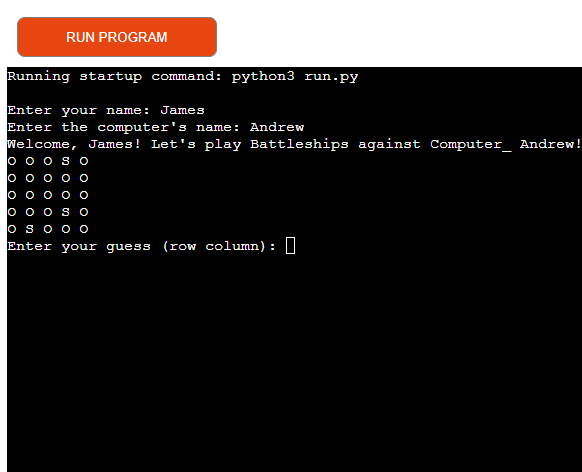
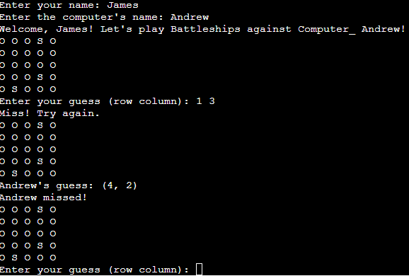
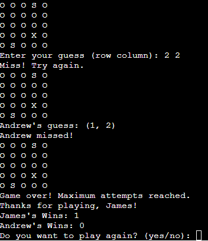

# Battleships Game

This is a simple implementation of the classic Battleships game in Python. The game allows you to play against a computer opponent. The objective is to sink all the opponent's battleships before they sink yours.

## How to Play

1. **Setup**: The game starts by creating a grid where you and the computer will place your battleships. You will be prompted to enter your name and the computer's name.
2. **Placing Battleships**: Battleships are placed randomly on the grid. You don't place your own ships; instead, they are placed by the program.
3. **Gameplay**: The game proceeds with each player taking turns guessing the coordinates of the opponent's battleships. You will be prompted to enter your guess as row and column numbers.
4. **Winning the Game**: The game continues until one player sinks all the opponent's battleships or the maximum number of attempts (5) is reached. If you sink all the computer's battleships, you win. If the computer sinks all your battleships, it wins.
5. **Play Again**: After the game ends, you have the option to play again.

## How to Run
1.Click on the link 
[Run The Game](https://battleships-game8-f3d58de3cd36.herokuapp.com/)
 
2. Press the Run program button

3. Enter your name and what you want the computer to be called.

4. Enter the row and column for what you want to guess.

5.When you have made 5 attempts enter yes or no to continue playing.¨

## Testing
[pip8](https://pep8ci.herokuapp.com/#)

1.It passed the test on pep8 without a problem. 

2.Tested giving it letters when it should be numbers and it went through correctly and corrected me.

## Bugs
* No bugs have occurred

## Deployment
1. Clone this repository.
2. Create new app in heroku.
3. Set the bulidbacks to python and NodeJs in that order.
4. Link the Heroku App TO the Repoistry.
5. Click on deploy.

## Credits
Code institute